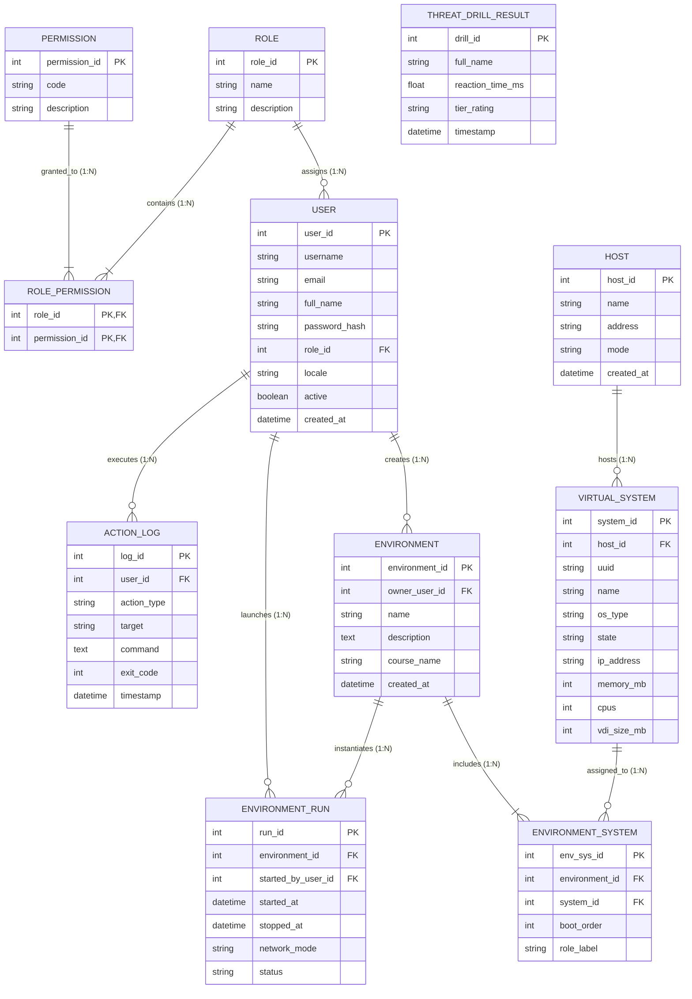

# CFMBA CyberLab Operations Center — תרשים קשרי ישויות (ERD) ומבנה מסד הנתונים

**מוסד אקדמי:** הקריה האקדמית אונו (Ono Academic College)  
**מנחה הפרויקט:** מר ג'ק אלטל (Mr. Jack Altal)  
**סטודנטית:** תמר מלכו (Tamar Molcho)  
**מערכת:** מרכז שליטה ובקרה למעבדות סייבר ווירטואליזציה (CFMBA CyberLab Operations Center)  

---

## 1. תרשים ERD גרפי (Entity Relationship Diagram)

התרשים מתאר את כל הישויות במערכת, המפתחות הראשיים (**PK**), המפתחות הזרים (**FK**), והקשרים ביניהם (1:N ו-N:M):

---

## 2. מילון ישויות ומבנה טבלאות (Data Dictionary)

### 2.1 טבלת `User` (משתמשי המערכת)
מנהלת את פרטי המרצים, מנהלי המערכת והסטודנטים:
* **`user_id`** (INTEGER, Primary Key, Auto Increment) — מזהה ייחודי למשתמש.
* **`username`** (VARCHAR(50), Unique, Not Null) — שם משתמש לכניסה.
* **`email`** (VARCHAR(120), Unique, Not Null) — דוא"ל אוניברסיטאי.
* **`full_name`** (VARCHAR(100)) — שם מלא לתצוגה.
* **`password_hash`** (VARCHAR(255), Not Null) — סיסמה מוצפנת ב-PBKDF2/SHA-256.
* **`role_id`** (INTEGER, Foreign Key -> `Role.role_id`) — שיוך לקבוצת תפקיד.
* **`locale`** (VARCHAR(10), Default 'he') — העדפת שפה (עברית / אנגלית).
* **`active`** (BOOLEAN, Default True) — האם החשבון פעיל או מושבת.
* **`created_at`** (DATETIME) — מועד יצירת החשבון.

### 2.2 טבלת `Role` (קבוצות תפקידים)
* **`role_id`** (INTEGER, Primary Key) — מזהה תפקיד.
* **`name`** (VARCHAR(50), Unique) — שם התפקיד (`admin`, `lecturer`, `student`).
* **`description`** (VARCHAR(255)) — תיאור הסמכות של הקבוצה.

### 2.3 טבלת `Permission` (הרשאות פרטניות)
* **`permission_id`** (INTEGER, Primary Key) — מזהה הרשאה.
* **`code`** (VARCHAR(50), Unique) — קוד זיהוי (`vm.control`, `vm.import`, `env.manage`).
* **`description`** (VARCHAR(255)) — הסבר על הפעולה המורשית.

### 2.4 טבלת קשר `RolePermission` (קשר רבים-לרבים N:M)
* **`role_id`** (INTEGER, Foreign Key -> `Role.role_id`, Composite PK).
* **`permission_id`** (INTEGER, Foreign Key -> `Permission.permission_id`, Composite PK).

### 2.5 טבלת `Host` (שרת מארח / Hypervisor)
* **`host_id`** (INTEGER, Primary Key) — מזהה השרת הפיזי.
* **`name`** (VARCHAR(50)) — כינוי המארח (`lab-host-1`).
* **`address`** (VARCHAR(100)) — כתובת IP מקומית (`127.0.0.1`).
* **`mode`** (VARCHAR(20)) — מצב פעולה (`real` מול VirtualBox אמיתי, או `demo` בסימולציה).

### 2.6 טבלת `VirtualSystem` (מכונות וירטואליות בצי)
מייצגת את 21 המכונות הווירטואליות מתוך צילומי המסך של המרצה:
* **`system_id`** (INTEGER, Primary Key) — מזהה רשומה פנימי.
* **`host_id`** (INTEGER, Foreign Key -> `Host.host_id`) — השרת המארח.
* **`uuid`** (VARCHAR(64), Unique) — מזהה חומרה ייחודי מ-VirtualBox.
* **`name`** (VARCHAR(100)) — שם המכונה (`Win7`, `Kali-Linux-2021.3`, `Splunk-SOC-Collector`).
* **`os_type`** (VARCHAR(50)) — סוג מערכת הפעלה (`Debian_64`, `Windows7_64`...).
* **`state`** (VARCHAR(20)) — מצב נוכחי (`running`, `stopped`, `paused`).
* **`ip_address`** (VARCHAR(45)) — כתובת IPv4 שהתקבלה מהרשת הפנימית.
* **`memory_mb`** (INTEGER) — זיכרון מוקצה ב-MB.
* **`cpus`** (INTEGER) — כמות מעבדים וירטואליים.
* **`vdi_size_mb`** (INTEGER) — נפח כונן VDI.

### 2.7 טבלת `Environment` (תרחיש מעבדה אקדמי)
מגדירה תרחיש לימודי המורכב ממספר מכונות (מסך 2 של המרצה):
* **`environment_id`** (INTEGER, Primary Key) — מזהה התרחיש.
* **`owner_user_id`** (INTEGER, Foreign Key -> `User.user_id`) — המרצה האחראי.
* **`name`** (VARCHAR(100)) — שם התרחיש (`תרגיל 3 - בדיקות חדירה ואבטחת שרתים`).
* **`description`** (TEXT) — הוראות והנחיות לסטודנט.
* **`course_name`** (VARCHAR(100)) — שם הקורס (`Offensive Security`).

### 2.8 טבלת `EnvironmentSystem` (שיוך מכונות לתרחיש)
* **`env_sys_id`** (INTEGER, Primary Key) — מזהה קשר.
* **`environment_id`** (INTEGER, Foreign Key -> `Environment.environment_id`).
* **`system_id`** (INTEGER, Foreign Key -> `VirtualSystem.system_id`).
* **`boot_order`** (INTEGER) — סדר ההדלקה (1 = שרת מטרה ראשון, 2 = מכונת תוקף).
* **`role_label`** (VARCHAR(50)) — תפקיד המכונה (`attacker`, `target-1`, `target-2`).

### 2.9 טבלת `EnvironmentRun` (הפעלת תרחיש מרוכזת — Batch Start)
* **`run_id`** (INTEGER, Primary Key) — מזהה ריצה.
* **`environment_id`** (INTEGER, Foreign Key -> `Environment.environment_id`).
* **`started_by_user_id`** (INTEGER, Foreign Key -> `User.user_id`).
* **`started_at`** (DATETIME) — זמן תחילת ההפעלה.
* **`stopped_at`** (DATETIME, Nullable) — זמן סיום ועצירה.
* **`network_mode`** (VARCHAR(30)) — `natnetwork` (בידוד פנימי) או `bridged` (חיבור לרשת המארח).
* **`status`** (VARCHAR(20)) — `active` או `closed`.

### 2.10 טבלת `ActionLog` (יומן פעולות ואבטחה)
* **`log_id`** (INTEGER, Primary Key) — מזהה רשומה.
* **`user_id`** (INTEGER, Foreign Key -> `User.user_id`, Nullable) — המשתמש שביצע.
* **`action_type`** (VARCHAR(50)) — סוג (`START_VM`, `STOP_VM`, `CLONE_VM`, `TAKE_SCREENSHOT`).
* **`target`** (VARCHAR(100)) — שם המכונה או הקובץ שהושפע.
* **`command`** (TEXT) — פקודת ה-Shell או ה-VBoxManage המדויקת שהורצה.
* **`exit_code`** (INTEGER) — קוד החזרה (0 = הצלחה).
* **`duration_ms`** (INTEGER) — משך הזמן שלקח ביצוע הפעולה במילישניות.
* **`timestamp`** (DATETIME) — זמן ביצוע הפעולה.

### 2.11 טבלת `ThreatDrillResult` (תרגיל תגובה לאירועי סייבר — results.csv)
* **`drill_id`** (INTEGER, Primary Key) — מזהה ניסיון.
* **`full_name`** (VARCHAR(100)) — שם הסטודנט / המפעיל (`fullName` בקובץ ה-CSV המקורי).
* **`reaction_time_ms`** (FLOAT) — זמן תגובה מנוטר במילישניות (`reactionTime`).
* **`tier_rating`** (VARCHAR(50)) — רמת מיומנות (`Apex <220ms`, `Tier-1 <320ms`, `Standard`).
* **`timestamp`** (DATETIME) — תאריך ושעה.

---

## 3. קשרים ורמת קישוריות (Cardinality)

1. **`Role` ל-`User` (קשר של 1 לרבים 1:N):**
   כל תפקיד (כגון מנהל או מרצה) יכול להיות משויך למספר משתמשים שונים, אך לכל משתמש יש תפקיד אחד בלבד.
2. **`Role` ל-`Permission` (קשר של רבים לרבים N:M):**
   תפקיד מוגדר באמצעות מספר הרשאות שונות, והרשאה בודדת יכולה להשתייך למספר תפקידים (ממומש בעזרת טבלת הקישור `RolePermission`).
3. **`Host` ל-`VirtualSystem` (קשר 1:N):**
   שרת מארח בודד יכול להכיל ולהריץ מכונות וירטואליות מרובות בצי שלו.
4. **`User` ל-`Environment` (קשר 1:N):**
   מרצה יכול ליצור ולהגדיר מספר תרחישי מעבדה שונים עבור קורסים מגוונים.
5. **`Environment` ל-`EnvironmentSystem` ל-`VirtualSystem` (קשר N:M):**
   תרחיש מעבדה כולל מספר מכונות וירטואליות, וכל מכונה וירטואלית יכולה להשתתף בתרחישים שונים עם תפקיד ייעודי (`role_label`).
6. **`Environment` ל-`EnvironmentRun` (קשר 1:N):**
   כל תרחיש מעבדה יכול להיות מופעל ומופסק מספר פעמים לאורך סמסטר הלימודים.
7. **`User` ל-`ActionLog` (קשר 1:N):**
   כל פעולה המתבצעת במערכת נרשמת ביומן ביקורת מאובטח המקושר למשתמש שביצע אותה.

---

## 4. צפייה חיה במערכת

התרשים מוטמע בצורה גרפית אינטראקטיבית ישירות בתוך ממשק האפליקציה:  
👉 **`http://127.0.0.1:5050/erd`**  
וניתן לצפות בו, להורידו, או להדפיסו ישירות לדוח הפרויקט האקדמי של תמר.
